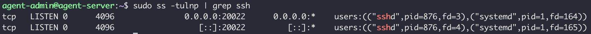
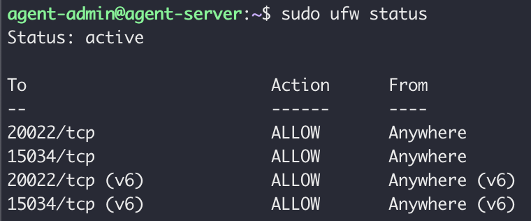
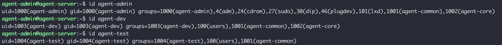
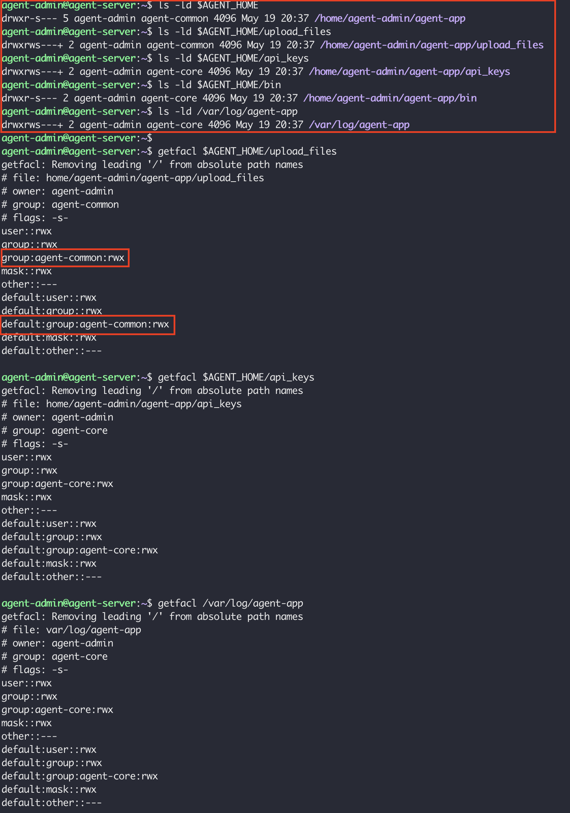
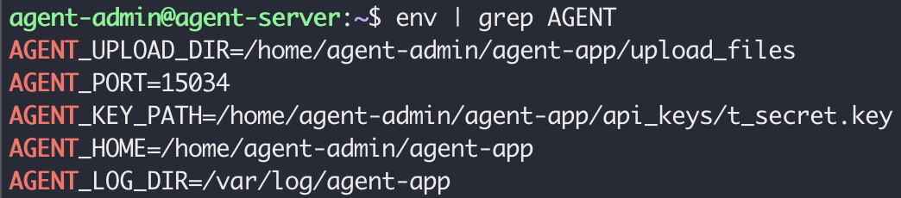
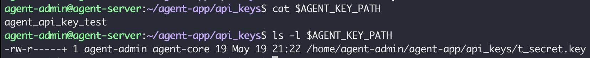
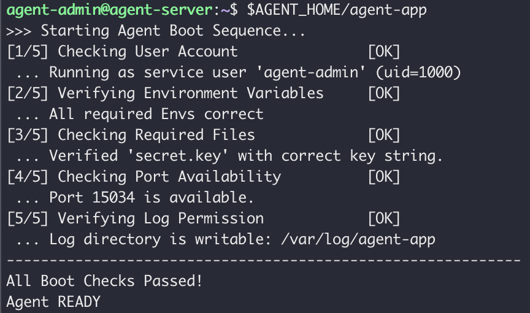
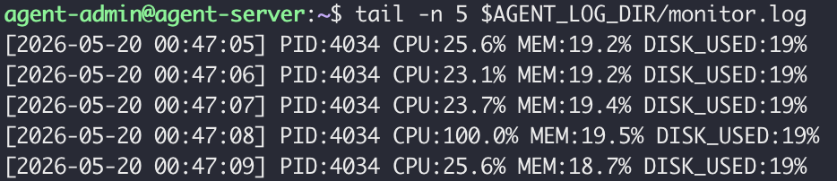
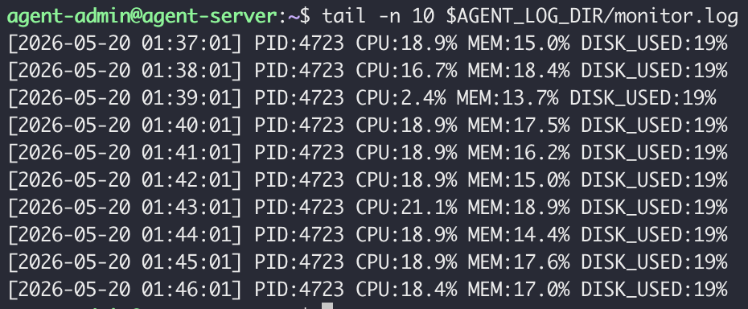
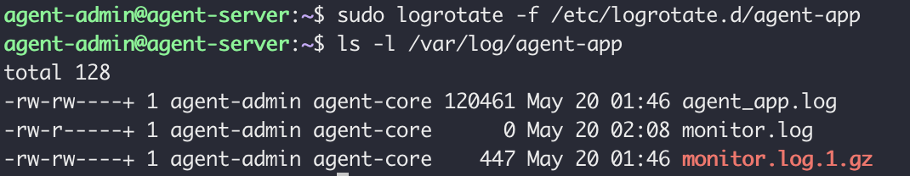

# 시스템 관제 자동화 스크립트 개발

## 1. 프로젝트 개요

Linux 서버 환경에서 사용자 계정 관리, 보안 설정, 디렉토리 권한 관리, 환경 변수 구성 및 시스템 모니터링 자동화를 구현하였습니다.

구현 항목:

- SSH 보안 설정
- UFW 방화벽 설정
- 사용자 / 그룹 관리
- ACL 권한 구성
- 환경 변수 구성
- Agent App 실행
- monitor.sh 구현
- cron 자동화
- logrotate 구성

---

## 2. 개발 환경

|항목|내용|
|---|---|
|Host OS|macOS|
|가상화 환경|UTM|
|Guest OS|Ubuntu Server 24.04 LTS|
|Architecture|x86_64|
|Terminal|iTerm2 + SSH|

환경 확인:

```bash
uname -a
ldd --version
ip addr
timedatectl
```

실행 결과:

```text
Linux agent-server
Ubuntu GLIBC 2.39
192.168.64.2
Time zone: Asia/Seoul
```

---

# 3. SSH 보안 설정

설정:

```bash
sudo nano /etc/ssh/sshd_config
```

수정:

```conf
Port 20022
PermitRootLogin no
```

적용:

```bash
sudo systemctl restart ssh
```

검증:

```bash
sudo ss -tulnp | grep ssh
```

결과:

```text
0.0.0.0:20022
```

SSH 접속:

```bash
ssh -p 20022 agent-admin@192.168.64.2
```

스크린샷:



---

# 4. 방화벽 설정

활성화:

```bash
sudo ufw enable
```

허용:

```bash
sudo ufw allow 20022/tcp
sudo ufw allow 15034/tcp
```

확인:

```bash
sudo ufw status
```

결과:

```text
20022/tcp ALLOW
15034/tcp ALLOW
```

스크린샷:



## 주요 명령어

```bash
# 특정 포트 허용
sudo ufw allow 20022/tcp

# 특정 포트 차단
sudo ufw deny 20022/tcp

# 허용 규칙 삭제
sudo ufw delete allow 20022/tcp

# 방화벽 상태 확인
sudo ufw status

# 규칙 번호 포함 확인
sudo ufw status numbered
```

---

# 5. 사용자 / 그룹 관리

생성 그룹:

```bash
sudo groupadd agent-common
sudo groupadd agent-core
```

사용자 생성:

```bash
sudo adduser agent-dev
sudo adduser agent-test
```

그룹 추가:

```bash
sudo usermod -aG agent-common agent-admin
sudo usermod -aG agent-core agent-admin

sudo usermod -aG agent-common agent-dev
sudo usermod -aG agent-core agent-dev

sudo usermod -aG agent-common agent-test
```

설명:

```text
usermod : 사용자 정보 수정

-a : 기존 그룹 유지(add)

-G : 그룹 추가
```

그룹 구성:

| 사용자 | 권한 그룹 |
|---|---|
| agent-admin | agent-common, agent-core |
| agent-dev | agent-common, agent-core |
| agent-test | agent-common |

검증:

```bash
id agent-admin
id agent-dev
id agent-test
```

예시:

```text
uid=1000(agent-admin)
groups=agent-common,agent-core

uid=1001(agent-dev)
groups=agent-common,agent-core

uid=1002(agent-test)
groups=agent-common
```

스크린샷:



---

# 6. 디렉토리 생성 및 ACL 설정

구성:

```text
$AGENT_HOME
├── upload_files
├── api_keys
├── bin

/var/log/agent-app
```

사용 명령어:

- `chown`: 파일/디렉토리 소유자(owner)와 그룹(group)을 변경
- `chmod`: 파일/디렉토리 접근 권한(rwx)을 설정
- `setfacl`: 사용자/그룹별 세부 ACL 권한 설정
- `getfacl`: 현재 ACL 권한 설정 조회

```bash
# 소유자/그룹 설정
sudo chown agent-admin:agent-common $AGENT_HOME
sudo chown agent-admin:agent-common $AGENT_HOME/upload_files
sudo chown agent-admin:agent-core $AGENT_HOME/api_keys
sudo chown agent-admin:agent-core $AGENT_HOME/bin
sudo chown agent-admin:agent-core /var/log/agent-app

# 권한 설정
sudo chmod 2750 $AGENT_HOME
sudo chmod 2770 $AGENT_HOME/upload_files
sudo chmod 2770 $AGENT_HOME/api_keys
sudo chmod 2750 $AGENT_HOME/bin
sudo chmod 2770 /var/log/agent-app

# ACL 설정
sudo setfacl -m g:agent-common:rwx $AGENT_HOME/upload_files
sudo setfacl -d -m g:agent-common:rwx $AGENT_HOME/upload_files

sudo setfacl -m g:agent-core:rwx $AGENT_HOME/api_keys
sudo setfacl -d -m g:agent-core:rwx $AGENT_HOME/api_keys

sudo setfacl -m g:agent-core:rwx /var/log/agent-app
sudo setfacl -d -m g:agent-core:rwx /var/log/agent-app

```

확인:

```bash
ls -ld $AGENT_HOME
ls -ld $AGENT_HOME/upload_files
ls -ld $AGENT_HOME/api_keys
ls -ld $AGENT_HOME/bin
ls -ld /var/log/agent-app
```

ACL 확인:

```bash
getfacl $AGENT_HOME/upload_files
getfacl $AGENT_HOME/api_keys
getfacl /var/log/agent-app
```

스크린샷:



---

# 7. 환경 변수 설정

설정:

```bash
export AGENT_HOME=/home/agent-admin/agent-app
export AGENT_PORT=15034
export AGENT_UPLOAD_DIR=$AGENT_HOME/upload_files
export AGENT_KEY_PATH=$AGENT_HOME/api_keys/t_secret.key
export AGENT_LOG_DIR=/var/log/agent-app
```

적용:

```bash
source ~/.bashrc
```

검증:

```bash
env | grep AGENT
```

스크린샷:



---

# 8. Key 파일 생성

생성:

```bash
cd $AGENT_HOME/api_keys
echo "agent_api_key_test" > t_secret.key

chmod 640 t_secret.key
```

검증:

```bash
cat $AGENT_KEY_PATH
ls -l $AGENT_KEY_PATH
```

결과:

```text
agent_api_key_test
-rw-r-----+ 1 agent-admin agent-core ...
```

스크린샷:



---

# 9. Agent App 실행

백그라운드 실행:

```bash
$AGENT_HOME/agent-app \
> $AGENT_LOG_DIR/agent_app.log 2>&1 &

# 실행
# > 로그 저장
# 2>&1 에러까지 저장
# & 백그라운드 실행
```

Boot 결과:

```text
All Boot Checks Passed
Agent READY
```

LISTEN 확인:

```bash
sudo ss -tuln | grep 15034
```

결과:

```text
LISTEN 0 1 0.0.0.0:15034
```

스크린샷:



---

# 10. monitor.sh 구현

[monitor.sh](./bin/monitor.sh): 시스템 상태 수집 스크립트

경로:

```bash
$AGENT_HOME/bin/monitor.sh
```

권한:

```bash
-rwxr-x--- 
```

주요 기능:

* 프로세스 상태 확인
* TCP LISTEN 상태 확인
* CPU 사용률 확인
* MEM 사용률 확인
* DISK 사용률 확인
* 로그 저장

실행:

```bash
$AGENT_HOME/bin/monitor.sh
```

출력:

```text
====== SYSTEM MONITOR RESULT ======

[HEALTH CHECK]

Checking process ... [OK]
Checking port ... [OK]

CPU Usage:0.0%
MEM Usage:0.0%
DISK Used:19%
```

로그:

```bash
tail -n 5 $AGENT_LOG_DIR/monitor.log
```

스크린샷:



---

# 11. Cron 자동화

등록:

```bash
crontab -e
```

설정:

```cron
* * * * * /home/agent-admin/agent-app/bin/monitor.sh
```

```text
1분마다 실행

*  *  *  *  *  /home/agent-admin/agent-app/bin/monitor.sh ──실행명령
│  │  │  │  │
│  │  │  │  └─ 요일
│  │  │  └──── 월
│  │  └─────── 일
│  └────────── 시
└───────────── 분
```

확인:

```bash
crontab -l
```

로그 증가 확인:

```bash
tail -n 10 $AGENT_LOG_DIR/monitor.log
```

스크린샷:



---

# 12. Log Rotate

### logrotate: 오래되거나 커진 로그를 이름 변경/압축/삭제하는 관리 도구

설정:

```bash
sudo nano /etc/logrotate.d/agent-app
```

설정 내용:

```conf
# 관리 대상 로그 파일
# monitor.sh가 기록하는 monitor.log에 아래 정책 적용
/var/log/agent-app/monitor.log {

    # logrotate 실행 시 사용할 사용자 / 그룹
    # 권한 문제 방지
    su agent-admin agent-core

    # 로그 파일 크기가 10MB 이상이면 rotate 수행
    size 10M

    # 오래된 로그를 최대 10개까지 유지
    # monitor.log.1.gz ~ monitor.log.10.gz
    rotate 10

    # rotate된 로그를 gzip(.gz)으로 압축
    compress

    # 로그 파일이 없어도 에러 발생시키지 않음
    missingok

    # 로그 파일이 비어있으면 rotate하지 않음
    notifempty

    # rotate 후 새 monitor.log 생성
    # 권한: 640
    # 소유자: agent-admin
    # 그룹: agent-core
    create 640 agent-admin agent-core
}
```

디버그:

```bash
sudo logrotate -d /etc/logrotate.d/agent-app
```

테스트:

```bash
sudo logrotate -f /etc/logrotate.d/agent-app
```

확인:

```bash
ls -l /var/log/agent-app
```

결과:

```text
monitor.log
monitor.log.1.gz
```

스크린샷:



---

# 13. 트러블슈팅

## GLIBC_2.38 오류

원인:

Ubuntu 22.04 환경에서 실행 바이너리 요구사항 미충족

해결:

Ubuntu Server 24.04 재설치

---

## monitor.sh Agent Down

원인:

agent-app 미실행

해결:

```bash
$AGENT_HOME/agent-app \
> $AGENT_LOG_DIR/agent_app.log 2>&1 &
```

---

## 시간대(KST) 문제

증상:

로그 시간이 실제 시간과 다름

해결:

```bash
sudo timedatectl set-timezone Asia/Seoul
```

---

## monitor.sh Permission denied

증상:

```bash
$AGENT_HOME/bin/monitor.sh
```

실행 시:

```text
Permission denied
```

원인:

sudo tee로 monitor.sh를 다시 생성하면서 파일 소유자와 실행 권한이 변경됨

기존 요구사항:

```text
소유자: agent-dev
그룹: agent-core
권한: 750
```

실제 상태:

```text
-rw-r--r-- root agent-core monitor.sh
```

확인:

```bash
# namei -l은 파일 경로를 구성하는 각 디렉토리와 파일의 권한을 단계별로 확인하는 명령어
namei -l $AGENT_HOME/bin/monitor.sh
```

해결:

```bash
sudo chown agent-dev:agent-core \
$AGENT_HOME/bin/monitor.sh

sudo chmod 750 \
$AGENT_HOME/bin/monitor.sh
```

# 14. 과제 요구사항 Q&A

## Q1. SSH 포트 변경과 Root 원격 접속 차단이 왜 기본 보안인가?

기본 SSH 포트(22)는 공격 대상이 되기 쉽다.  
포트를 변경하면 자동 스캔이나 무차별 대입 공격 노출을 일부 줄일 수 있다.

또한 Root 계정은 시스템 전체 권한을 가진다.

Root 원격 접속을 허용하면:

- 계정 탈취 시 전체 시스템 위험
- 감사 추적 어려움
- 권한 분리 불가능

따라서 일반 계정으로 접속 후 sudo를 사용하는 방식이 기본 보안 정책이다.

---

## Q2. UFW에서 필요한 포트만 허용하는 이유는?

방화벽은 기본적으로 접근 가능한 서비스 범위를 최소화하기 위한 목적이다.

이번 과제에서는:

- 20022 → SSH
- 15034 → agent-app

만 허용하였다.

필요하지 않은 포트를 닫으면:

- 공격 표면 감소
- 불필요한 서비스 차단
- 관리 범위 축소

효과가 있다.

검증:

```bash
sudo ufw status
```

---

## Q3. 공유 디렉토리와 보안 디렉토리를 ACL로 분리하는 이유는?

모든 사용자에게 동일한 권한을 부여하면 민감한 정보가 불필요하게 노출될 수 있다.

이번 과제에서는 역할 기반 접근 제어(RBAC) 개념을 적용하여 디렉토리 목적에 따라 권한을 분리하였다.

공유 목적 디렉토리:

```text
upload_files
```

접근 그룹:

```text
agent-common
```

용도:

- 여러 사용자가 업로드 파일 공유
- 공동 작업 영역

보안 목적 디렉토리:

```text
api_keys
```

접근 그룹:

```text
agent-core
```

용도:

- API Key 저장
- 제한된 사용자만 접근

ACL을 사용한 이유:

- 사용자/그룹별 세부 권한 설정 가능
- Linux 기본 권한(chmod)보다 유연함
- 역할에 따라 접근 범위 분리 가능
- 중요 데이터 노출 방지

실제 운영 환경에서도 로그, 업로드 파일, 인증 키 저장소를 분리하여 관리하는 방식이 자주 사용된다.

---

## Q4. 환경 변수로 실행 환경을 고정하는 이유는?

환경 변수를 사용하면 경로와 설정값을 코드에 직접 작성하지 않아도 된다.

예:

```bash
export AGENT_HOME=/home/agent-admin/agent-app
```

장점:

- 경로 변경 대응
- 유지보수 편의성
- 설정 재사용 가능

검증:

```bash
env | grep AGENT
```

---

## Q5. monitor.sh가 프로세스/포트/리소스를 수집하는 이유는?

운영 환경에서는 장애 발생 여부를 빠르게 확인해야 한다.

monitor.sh는:

- 프로세스 실행 상태
- TCP LISTEN 상태
- CPU 사용률
- 메모리 사용률
- 디스크 사용량

정보를 수집한다.

그리고:

```text
monitor.log
```

에 기록하여 장애 발생 시 원인 분석에 사용한다.

---

## Q6. cron과 logrotate가 필요한 이유는?

운영 환경에서는 시스템 상태를 한 번 확인하고 끝나는 것이 아니라 지속적으로 수집하고 관리해야 한다.

이번 과제에서는 모니터링 자동화와 로그 관리 자동화를 위해 cron과 logrotate를 사용하였다.

### cron

cron은 Linux의 작업 스케줄러로 지정한 시간마다 명령어를 자동 실행한다.

이번 과제 설정:

```cron
* * * * * /home/agent-admin/agent-app/bin/monitor.sh
```

의미:

```text
매 분마다 monitor.sh 실행
```

실행 흐름:

```text
cron
→ monitor.sh 실행
→ CPU / MEM / PORT 상태 확인
→ monitor.log 기록
```

수동 실행과 비교:

수동:

```text
사용자가 직접 실행 필요
```

자동:

```text
시스템이 정해진 시간마다 실행
```

장점:

- 반복 작업 제거
- 실시간 상태 추적 가능
- 운영 자동화 가능

---

### logrotate

로그 파일은 시간이 지날수록 계속 증가한다.

모니터링 로그를 계속 저장하면:

```text
monitor.log
→ 수 MB
→ 수백 MB
→ 수 GB
```

장기간 운영 시 디스크 공간 부족 문제가 발생할 수 있다.

이번 과제 설정:

- 10MB 이상 시 회전
- 최대 10개 보관
- gzip 압축
- 오래된 로그 자동 삭제

동작 흐름:

```text
monitor.log
↓
monitor.log.1.gz
↓
monitor.log.2.gz
↓
오래된 로그 삭제
```

장점:

- 디스크 사용량 제어
- 오래된 로그 자동 정리
- 로그 보관 정책 적용 가능
- 장기 운영 안정성 확보

실제 서버 운영 환경에서도 모니터링, 웹 서버, 애플리케이션 로그는 대부분 logrotate와 함께 사용된다.

